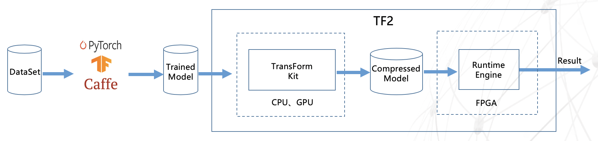
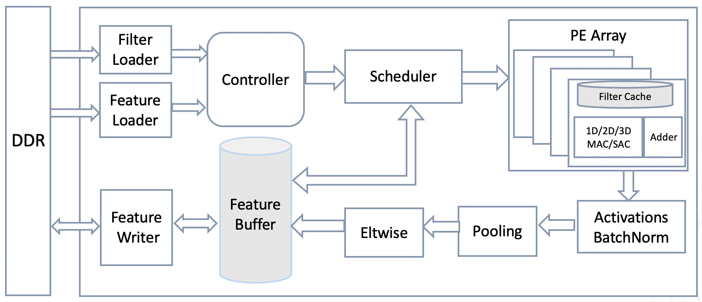

# Inspur Deep Learning Inference Accelerator TF2

## TF2

TF2 is a deep learning inference accelerator based on FPGA computing platform, developed by Inspur AI & HPC. A wide range of general purpose deep neural networks can be supported. Models from popular deep learning frameworks such as Pytorch, TensorFLow, and Caffe can be loaded into TF2 easily by toolkits we supplied. The pretrained deep learning model can be compiled into FPGA without any code level FPGA development work, which can be an agile solution for AI inference applications on FPGA. See the link https://1drv.ms/b/s!Am9Mk04MA_K1bpXjzmHS8U04PSI?e=LaSgjb for our paper:
A Deep Learning Inference Accelerator Based on Model Compression on FPGA

The TF2 accelerator is composed of two parts: Transform Kit and Runtime Engine. 

## TransForm Kit

Transform Kit is a tool for model optimization and conversion with modules of model compression, pruning and quantification, etc. Transform Kit aims to reduce model data size and simplify mathmatical calculation. Additionally, computational node fusion can also be done in transform kit to relax the data access bandwidth limitation on computing performance by integrating multiple computing nodes into one. Runtime Engine can automatically convert the previously optimized model file into FPGA targeting file by compiling. The compression and pruning operations are optional.

### Compression

Model compression is based on Inspur optimized Incremental Network Quantization(INQ) compression method. Deep neural network model data trained by Pytorch and other frameworks can be used as input. It can compress 32-bit floating-point model data into 4-bit integers, making the actual model data size 1/8 of the original with original data structure maintained. The represented value of the compressed model is 4-bit integeral power of 2 or 0. Four 4-bit data is stored as 1 short type data. The accuracy of the typical CNN with or without compression is shown in the following table.

| NetWork    | Top1   | Top5   | Top1(Compressed) | Top5 (Compressed) |
| ---------- | ------ | ------ | ---------------- | ----------------- |
| Alexnet    | 0.5676 | 0.7990 | 0.5687           | 0.8000            |
| VGG16      | 0.6828 | 0.8827 | 0.7055           | 0.8994            |
| GoogLeNet  | 0.6889 | 0.8898 | 0.6857           | 0.8887            |
| ResNet50   | 0.7276 | 0.9101 | 0.7465           | 0.9248            |
| SqueezeNet | 0.5750 | 0.8030 | 0.5900           | 0.8040            |

| NetWork | Map    | Map(Compressed) |
| ------- | ------ | --------------- |
| SSD     | 0.7773 | 0.7757          |

### Pruning

TF2 Pruning unit includes random pruning and channel pruning modules ( code will be published later ). The random pruning algorithm is a high pruning rate method, but the pruned model is a sparse model. Channel pruning is a kind of structuralized pruning, which is a dynamic pruning method. This method can directly reduce the channels to lower the computational cost. The advantages of this method are 1. the pruned model can be re-trained to the original accuracy with limited training iterations 2. the pruned model can be directly loaded into TF2 Runtime Engine. The pruning rate and the accuracy with or without pruning of ResNet50 are shown in the table below. Model pruning can realize 1.6x speedup on FPGA.

| Pruned Ratio | Top1   | Top5   | Top1-gap | Top5-gap |
| ------------ | ------ | ------ | -------- | -------- |
| 0%           | 0.7277 | 0.9109 | -        | -        |
| 50%          | 0.7289 | 0.9118 | 0.13% ↑  | 0.17% ↑  |
| 60%          | 0.7183 | 0.9079 | 0.93% ↓  | 0.22% ↓  |

### Quantization

Since the model is innately 4-bit data after compression, the quantization of TF2 is only for feature map data. TF2 quantization tool can quantize normalized 32-bit single-precision floating-point feature map data to 8-bit integer, that is, quantized to -128 to 127. The main advantage of feature map data quantization is that it can reduce the storage resource requirement of on-chip feature data by a quarter, and can reduce the logic calculation required for data processing, greatly improving the computing power of FPGA. The algorithm is described as follows:

1) Calculating the maximum value fmax of the absolute value of the feature map data of each channel of each convolution layer of the neural network;

2) Find Q according to the equation: 128 = power(2, Q) * fmax;

3) According to the equation above, the quantized data V = power(2, Q) * fv, where fv is the original single-precision floating-point data.

The calculation accuracy of deep learning neural network SqueezeNet and ResNet50 with or without quantization is shown in the following table.

| NetWork    | Top1   | Top5   | Top1(Quantized) | Top5(Quantized) |
| ---------- | ------ | ------ | --------------- | --------------- |
| Squeezenet | 0.5900 | 0.8040 | 0.5900          | 0.8010          |
| ResNet50   | 0.7145 | 0.9010 | 0.7120          | 0.9043          |

## RunTime Engine

The TF2 Runtime Engine is an intelligent runtime FPGA accelerator which can automatically generate FPGA executive files. It first parses the network structure file and generates the network configuration file required by the Runtinme Engine, and then recompiles FPGA code, which can automatically generates the FPGA executive file.

With the 4-bit integeral power of 2 compressed model data and the 8-bit integeral feature map data in Runtime Engine, the multiplication of model data and feature map data can be converted to shift operation, which eliminates the dependency for DSP floating-point computing resources on FPGA, greatly improves the performance of deep neural network inference on FPGA and effectively reduces its operating power consumption.

The TF2 Runtime Engine top-level computing architecture is shown below. Multiple convolutional layers are executed serially on the FPGA. In order to reduce the storage access limitation on computing performance, the intermediate feature map data is preferentially stored on the chip as much as possible. The model data is read from the external DDR to the FPGA in real time during the calculation process, but reading operation can be performed simultaneously with the calculation, that is, the reading time can be "hidden" under the calculation time. The core computing architecture of TF2 Runtime Engine is shown below.

The Filter Loader reads model data from the DDR to the chip. The Feature Loader reads the input picture and feature map data from the DDR to the on-chip cache. The Controller generates a control signal for the Scheduler. The Scheduler reads the Feature data according to the control signal, and sends data such as Feature, Filter, timing signal, and control signal to the PE for calculation. PE Array is the core computation unit of the entire computing architecture, performing Shift Accumulate (SAC) or Multiply Accumulate(MAC) calculations . The current version is SAC, which will be updated by MAC computing. There is a Filter Cache in PE, which is used to store the Filter data for calculating current output channel. The Adder adds the partial results of the MAC/SAC calculations to generate the final convolution results. The number of PEs in a PE Array can be configured according to the structure of the neural network and the amount of FPGA resources. MAC/SAC can be calculated in 1D, 2D, or 3D, and can be configured according to field application. The current version has 2D and 3D calculations. The vector length calculated by each MAC/SAC dimension can also be configured according to the specific application and FPGA computing resources. Networks such as ResNet50/SqueezeNet computiing performance is listed as follows.

| NetWork                   | Throughput(fps) |
| ------------------------- | --------------- |
| SqueezeNet                | 1485            |
| GoogLeNet                 | 306             |
| FaceNet(MTCNN+SqueezeNet) | 1020            |

## RoadMap

#### 2019-Q2

Transform kit: Model comression and 8-bit quantization algorithm based on Pytorch.

Runtime Engine: CNN accelerator architecture based on OpenCL that uses SAC caculations.

Models: ResNet50, GoogLeNet, etc., can be tested directly based on the Inpur F10A board.

#### 2019-Q3

Transform Kit: Random pruning and channel pruning algorithm for CNN, automated model conversion tool.

Runtime Engine: An automatic model analysis tool and new CNN accelerator architecture for MAC caculations.

#### 2019-Q4

Transform Kit: More structural pruning algorithms and 4-bit quantization algorithm for CNN.

Runtime Engine: A general-purpose computing architecture for sparse models.

#### 2020-Q1

Transform kit: Any bit quantization algorithm for CNN networks.

Runtime Engine: Accelerator architecture that supports TransFormer computing.

#### 2020-Q2

Transform Kit: AutoML based pruning and quantization algorithm, NLP network optimization algorithm.

Runtime Engine: Support the NLP universal model and update the computing architecture continuously.

## Releases and Contributing

We appreciate all contributions. If you are planning to contribute back bug-fixes, or add new algorithms about compression or pruning, please do so without any further discussion.

If you plan to update computing architecture of FPGA, please first open an issue and discuss the feature with us. Sending a PR without discussion might end up resulting in a rejected PR, because we might be taking the architecture in a different direction than you might be aware of.

## Reference

1. Utku Aydonat, Shane O’Connell, Davor Capalija, Andrew C Ling, and Gordon RChiu. 2017. An Open deep learning accelerator on arria 10. In Proceedings of the 2017 ACM/SIGDA International Symposium on Field-Programmable Gate Arrays. ACM, 55–64.
2. Aojun Zhou, Anbang Yao, Yiwen Guo, Lin Xu, and Yurong Chen. 2017. Incremental network quantization: Towards lossless cnns with low-precision weights.arXiv preprint arXiv:1702.03044 (2017).

## License

[Apache License 2.0](LICENSE)
