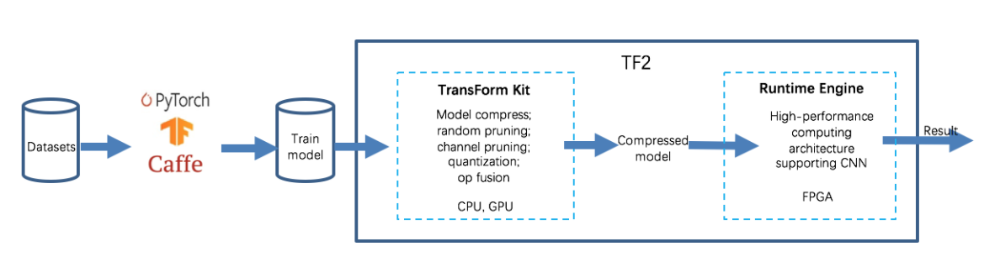
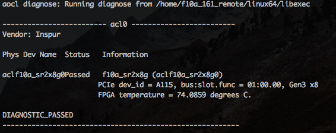

# Brief Introduction

TF2 is the first FPGA compute acceleration engine by the world's first DNN shifting technology on FPGAs. It's an end-to-end full stack solution for the deployment of machine learning model, which consists of following two parts, TF2 Transform Kit and TF2 Runtime Engine. Firstly the Transform Kit takes charge of compressing DNN models trained by frameworks such as PyTorch, TensorFlow, Caffe, etc. Then TF2 Runtime Engine converts the compressed and optimized model file into FPGA target runing file automatically. Four-bit Network Model compression and eight-bit feature data compression are implemented by TF2 Transform Kit and TF2 Runtime Engine seperately.





# TF2 Installation

##Quartus SDK installation

Software Download link

http://fpgasoftware.intel.com/16.1/?edition=pro

Intel FPGA Software Installation and Licensing Quick Start

https://www.intel.com/content/www/us/en/programmable/documentation/esc1425943996095.html#esc1426014513666

## BSP installation

###Inspur F10A BSP download link

Please contact Inspur agent to get the BSP installation package.

###Installation steps:

After burning Inspur FPGA board drivers, install BSP as following steps,

 ```shell
yum install gcc gcc-c++
chmod -R 777 /<yourpath>/f10a_161_remote/
source /<yourpath>/fpga_env_161.sh
cd $AOC_BOARD_PACKAGE_ROOT
cd source
make clean
make
source /<yourpath>/fpga_env_161.sh
aocl install
 ```

Check installation result use

```shell
aocl diagnose
```

If you get below result, congratulations for the successul installation



## Compiling

### Evaluation mode

```shell
aoc -march=emulator src/cnn.cl -v
```

### Actual FPGA running mode

```shell
aoc src/cnn.cl -v
```

## Run

### Evaluation mode

After compiling,  use following command to run in evaluation mode

```shell
#CL_CONTEXT_EMULATOR_DEVICE_ALTERA=1 ./bin/host ../host/model/<your_model_file_path> ../host/model/<your_quantization_file_path> ../host/test_images/<your_test_file_path>
```
for example:

```shell
#CL_CONTEXT_EMULATOR_DEVICE_ALTERA=1 ./bin/host ../host/model/googlenet/param.bin ../host/model/googlenet_Q ../host/test_images/googlenet_data_label_391.bin 1
```

### Actual FPGA running mode

The precompiled rpd files are stored in ./cnn/device/rpd/. 
Please make sure .rpd file has been burned sucessfully with following command, before running program in FPGA

```
remote_update aclf10a_sr2x8g0 -l f
flash_pcie aclf10a_sr2x8g0 <your_rpd_filename.rpd>
remote_update aclf10a_sr2x8g0 -l 
```

Then execute command to run your program

```shell
./bin/host ../host/model/<your_model_file_path> ../host/model/<your_quantization_file_path> ../host/test_images/<your_test_file_path>
```
for example:

```shell
./bin/host ../host/model/googlenet/param.bin ../host/model/googlenet_Q ../host/test_images/googlenet_data_label_391.bin 1
```

# Trained Model

GoogLeNet, ResNet50 and ResNet50_pruned models are trained and uploaded. Please refer to /cnn/host/models/README for details.

